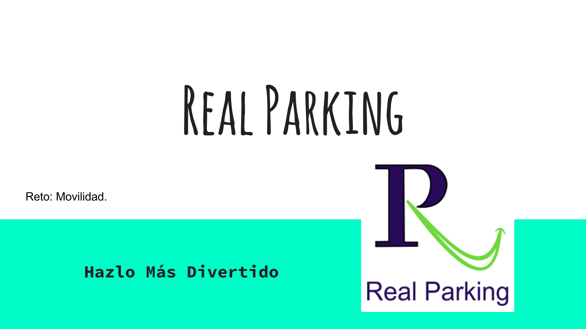
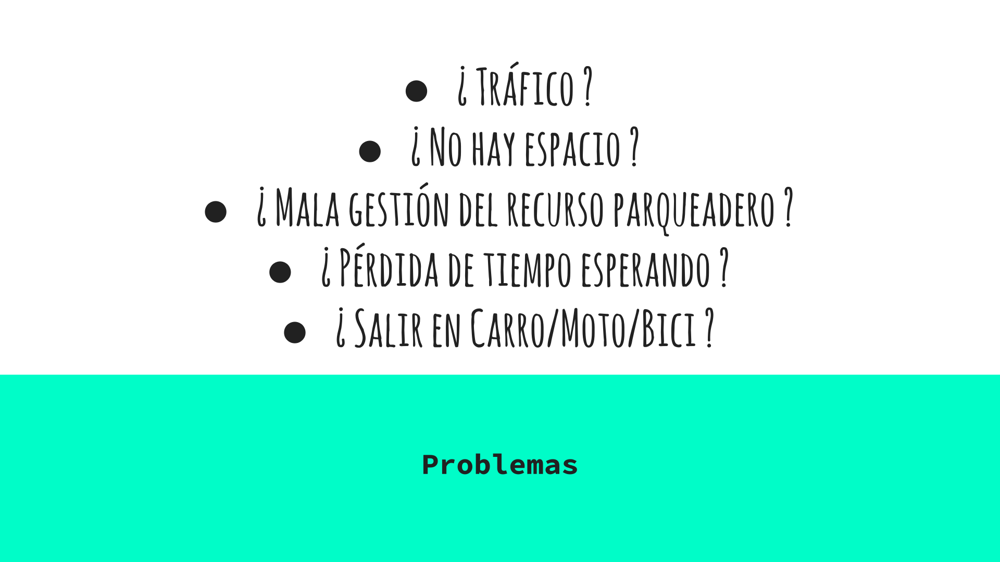
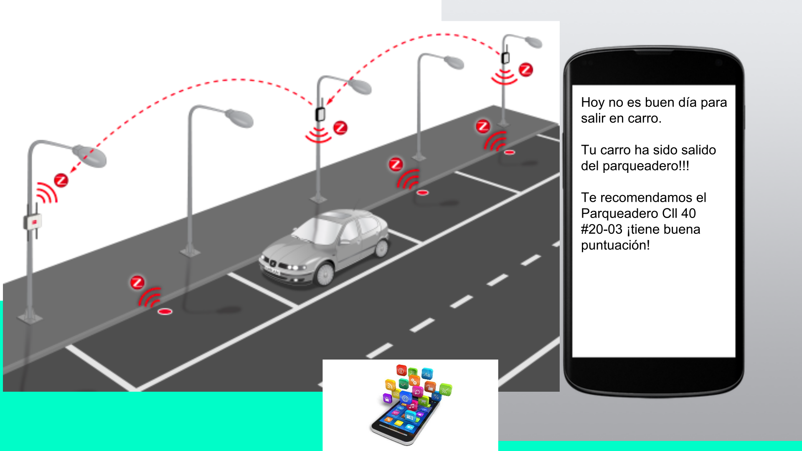
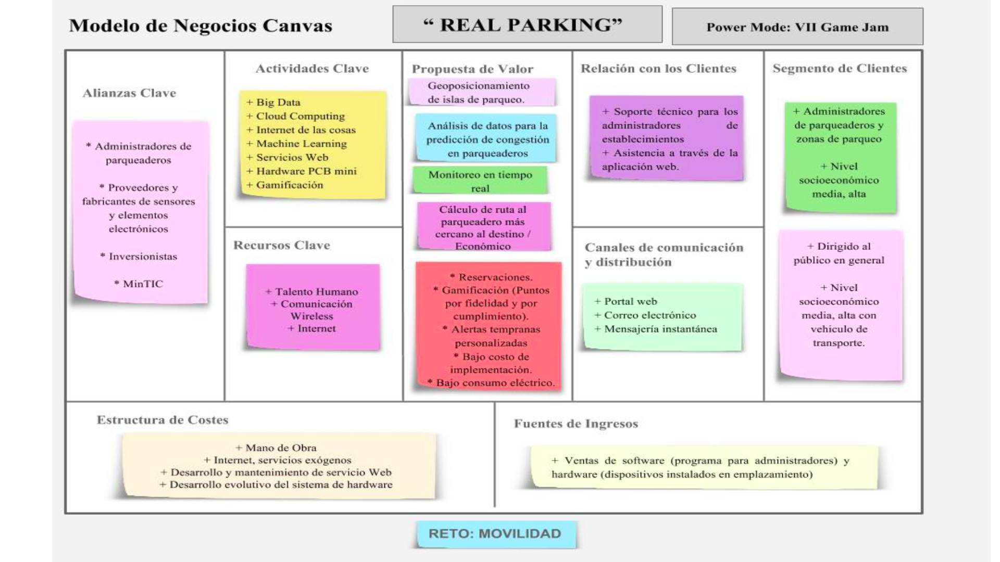
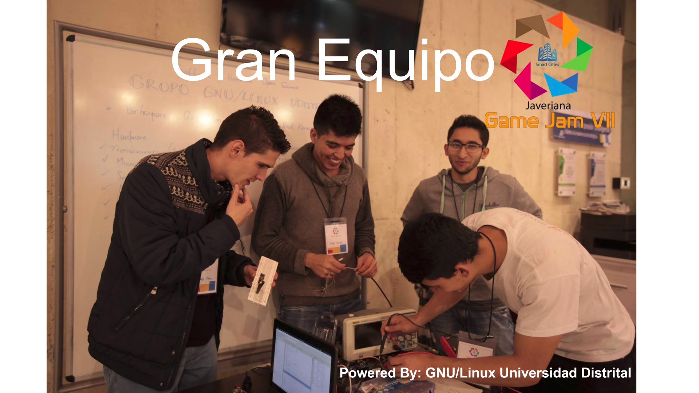
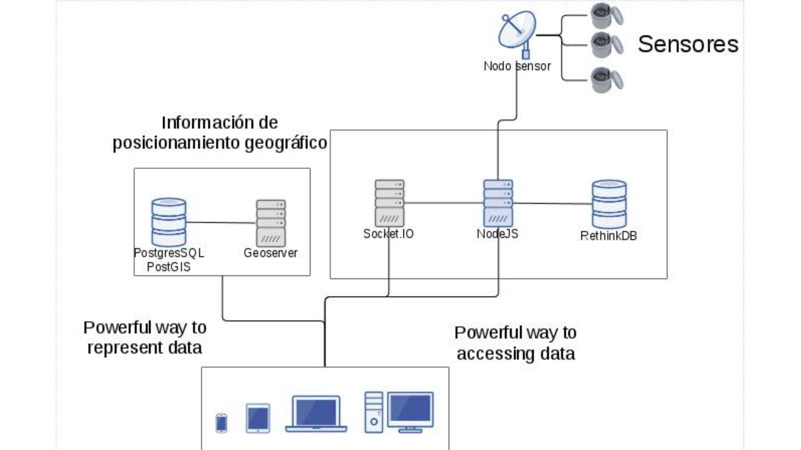
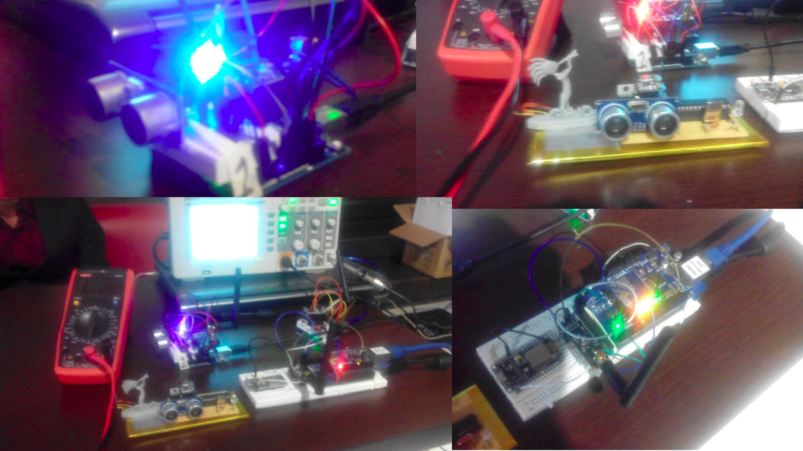
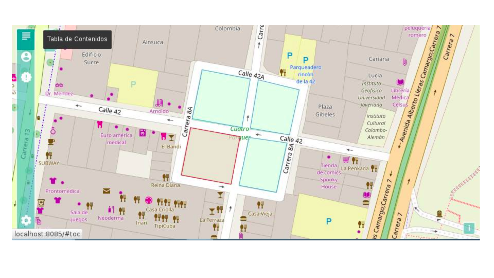

# real-parking
Proyecto de Software y Hardware que pretente mejorar la movilidad de los parqueaderos a partir del análisis de datos.

Es un sistema escalable de parqueaderos. Busca ver toda la ciudad como un gran parqueadero y ayuda a gestionar de mejor manera el recurso espacial. Tiene un incentivo de gamificación con lo cuál se premia fidelidad a un parqueadero, entre otras cosas. Tiene un módulo de recomendaciones que dice cuál es el parqueadero mejor en relación precio/distancia del destino.

### INFORMACIÓN DE CONTACTO DESARROLLADORES ###

* Desarrollador: Jorge Ulises Useche Cuellar
Ingeniero Electónico de la Udistrital FJC
Movil: 3114813719
Twitter: @juusechec
LinkedIn: https://co.linkedin.com/in/juusechec

* Desarrollador: Diego Javier Mena Amado
Ingeniero Electrónico de la UDistrital FJC
Movil: 3133067541
Twitter: @DiegoJavierMena 
LinkedIn: https://www.linkedin.com/in/diego-javier-mena-amado-3357a873/en

* Desarrollador: Andrés Angarita
Ingeniero de Sistemas de la UDistrital FJC
Movil: 
Twitter: @ 
LinkedIn: 

* Desarrollador: David Castelblanco
Ingeniero de Sistemas de la UDistrital FJC
Movil: 
Twitter: @ 
LinkedIn: 

### Material de Presentación ###

https://www.youtube.com/watch?v=H8S8lVXx5Ek

